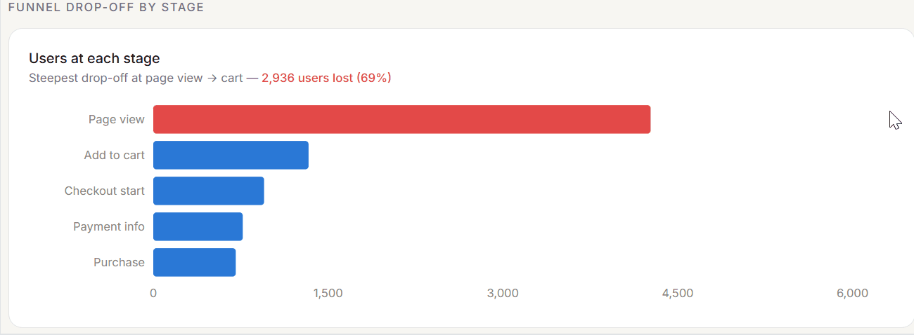
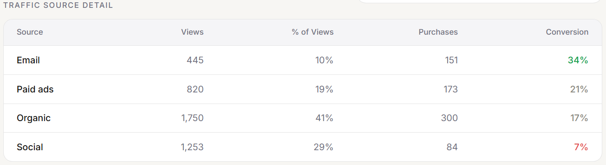
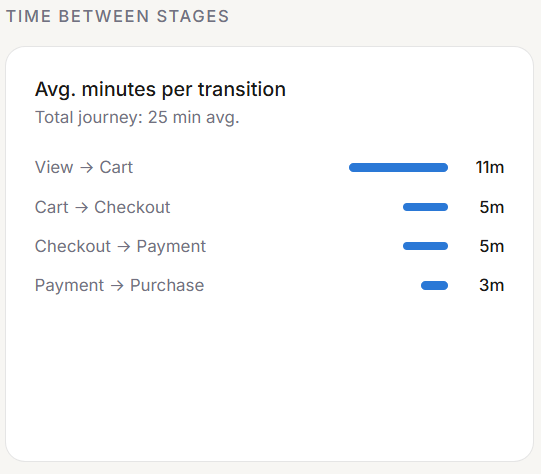
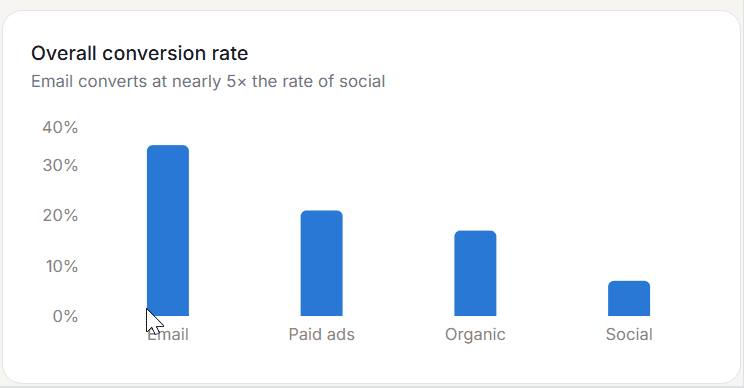

# E-Commerce Funnel Analysis — Meridian Commerce

## Project Background
Meridian Commerce is a direct-to-consumer lifestyle and home goods brand founded in 2021. Operating exclusively online, the company acquires customers through four primary channels — organic search, paid ads, email marketing, and social media — and fulfils orders across North America. Key business metrics include monthly GMV, purchase conversion rate, customer acquisition cost by channel, and average order value.

As a data analyst at Meridian Commerce, I was tasked with investigating a plateau in monthly revenue. Leadership suspected users were dropping off somewhere in the purchase funnel but had no visibility into where or why. This analysis models the full 5-stage purchase funnel using raw event data to identify drop-off points, quantify the revenue impact, and determine whether conversion performance differs by acquisition channel.

Insights and recommendations are provided on the following key areas:

- **Funnel Drop-off:** Where users abandon the purchase journey and the revenue cost of each stage
- **Traffic Source Performance:** Which acquisition channels drive the highest and lowest conversion rates
- **Time to Conversion:** How long converting users take to move through the funnel and where friction exists
- **Revenue Impact:** Quantifying potential lost revenue at each funnel stage to prioritise optimisation efforts

The dbt models used to build and transform this data can be found [here](models/).

An interactive dashboard used to explore funnel trends can be found [here](https://www.figma.com/make/jRbsL797V5WL0gSDJl0sOu/Ecommerce-Funnel-Stages?fullscreen=1&t=74gKXGrcjbs1t6RB-1&code-node-id=0-9).

---

## Data Structure & Initial Checks
Meridian Commerce's event tracking system logs one row per user action. The raw `user_events` table contains 5 event types across the purchase funnel, with the following schema:

| Column | Type | Description |
|---|---|---|
| event_id | STRING | Unique identifier per event |
| user_id | INTEGER | Unique identifier per user |
| event_type | STRING | One of: page_view, add_to_cart, checkout_start, payment_info, purchase |
| event_date | TIMESTAMP | When the event occurred |
| product_id | STRING | Product associated with the event |
| amount | FLOAT | Purchase amount (populated for purchase events) |
| traffic_source | STRING | Acquisition channel: organic, paid_ads, email, social |

The dbt pipeline transforms this into three mart tables:
- `fct_funnel_summary` — overall funnel metrics and lost revenue
- `fct_funnel_by_source` — funnel performance broken down by traffic source
- `fct_time_to_conversion` — average time between each funnel stage

---

## Executive Summary
### Overview of Findings

In the most recent 30-day window, Meridian Commerce's purchase funnel converted only 17% of 4,268 visitors — generating an estimated $379K in potential lost revenue. The critical failure point is the view-to-cart transition, which alone accounts for 82% of that loss. Email is Meridian Commerce's highest-performing channel at 34% conversion, yet receives a disproportionately small share of traffic (10%), while social — the second largest traffic source at 29% of views — converts at just 7%.


---

## Insights Deep Dive

### Funnel Drop-off

**The view-to-cart stage is the primary failure point.** Only 31% of 4,268 page view users added a product to cart — the steepest single-stage drop in the funnel. Every subsequent stage converts at 71% or higher, making this stage an outlier.

**82% of all potential lost revenue is concentrated at one stage.** The $312,713 lost at the view-to-cart transition dwarfs every other stage combined ($66,462). This asymmetry means fixing this one step has outsized revenue impact.

**Later funnel stages are relatively healthy.** Cart-to-checkout (71%), checkout-to-payment (81%), and payment-to-purchase (92%) all show strong progression — users who add to cart are largely committed buyers.

**Overall conversion sits at 17%.** The gap between page view and purchase suggests the top of funnel is attracting low-intent traffic or encountering friction before the cart.



---

### Traffic Source Performance

**Email is Meridian Commerce's highest-converting channel at 34%** — nearly double the next best channel (paid ads at 21%) and nearly 5x the worst (social at 7%).

**Social drives high volume but low value.** With 29% of total views (1,253 visitors), social is the second largest traffic source but converts at just 7% — the worst of any channel.

**A 27 percentage point gap exists between the best and worst channels.** Email (34%) vs social (7%) represents a dramatic difference in traffic quality that current spend allocation does not reflect.

**Organic traffic performs below its potential.** At 41% of views (1,750 visitors) and 17% conversion, organic is the largest source but converts at the overall average — suggesting room for landing page optimisation.

| Source | % of Views | Conversion Rate |
|---|---|---|
| Email | 10% | 34% |
| Paid Ads | 19% | 21% |
| Organic | 41% | 17% |
| Social | 29% | 7% |



---

### Time to Conversion

**Converting users complete the entire funnel in 25 minutes on average.** This is a short consideration window — converting users arrive with high intent and purchase quickly when the experience is smooth.

**View-to-cart is the slowest transition at 11 minutes (44% of total journey time).** This is the stage with both the longest time and the highest drop-off — a strong signal that friction exists before the cart, not after it.

**Once users reach checkout, the journey accelerates sharply.** Cart-to-checkout (5 min), checkout-to-payment (5 min), and payment-to-purchase (3 min) are all fast — the checkout experience itself is not the problem.

**The short total journey time has an important implication.** Users who convert are decided buyers. Any interruption — slow load times, unclear CTAs, forced account creation — disproportionately costs a sale that was otherwise likely to close.



---

### Revenue Impact

**Total potential lost revenue across all stages is $379,175.** This represents revenue that would have been captured if every user who entered the funnel completed a purchase, based on an average order value of $106.51.

**The cart stage alone accounts for $312,713 of that loss.** The 2,936 users who viewed a product but never added to cart represent the single largest revenue recovery opportunity.

**Checkout and payment stages contribute $66,462 combined.** While smaller in absolute terms, these users were closer to purchasing — recovery here may require less effort per dollar recovered.



---

## Recommendations
Based on the insights above, we recommend the marketing and product teams consider the following:

**Prioritise add-to-cart friction reduction.** The view-to-cart stage accounts for 82% of lost revenue and converts at 31% — well below all later stages. A/B test CTA placement, product page layout, and load speed to identify friction points.

**Reallocate acquisition spend from social to email.** Email converts at 34% with minimal traffic share (10%). Scaling email volume — through list growth, win-back campaigns, or retargeting — is the highest-ROI lever currently available.

**Investigate social traffic quality.** With 29% of views and 7% conversion, social is underperforming significantly. Audit targeting parameters and landing page alignment to determine whether this is an audience quality or experience issue.

**Optimise organic landing pages.** Organic drives the most traffic (41%) but converts at the overall average (17%). Improving page relevance and intent matching for organic visitors could move the overall conversion rate meaningfully.

**Monitor the 25-minute conversion window.** Since converting users purchase quickly, any experience degradation — performance issues, checkout errors — will have immediate revenue impact. Instrument real-time funnel monitoring.

---

## Assumptions and Caveats

**Lost revenue is estimated, not actual.** Potential lost revenue is calculated by multiplying users who did not progress by the average purchase amount ($106.51). Actual recoverable revenue would be lower — not every dropped user would have converted under ideal conditions.

**The 30-day window is relative to the dataset, not today.** The date filter applies a rolling 30-day window from the maximum event date in the dataset — not from the current date. Results reflect a fixed historical period.

**User journey times only include converting users.** Time-to-conversion metrics are calculated from users who completed a purchase. Non-converting users are excluded, so these figures represent a best-case journey time.

**Traffic source attribution is last-touch.** The `traffic_source` column reflects the channel recorded at the time of the event. Multi-touch attribution is not modelled — email's true contribution may be higher if it assists conversions attributed to other channels.

---

## Tech Stack
- BigQuery
- SQL
- dbt

## dbt Project Structure
```
models/
  staging/
    stg_user_events.sql              # Cleans and renames raw event data
  intermediate/
    int_funnel_stages.sql            # Stage counts and avg purchase amount
    int_user_journey_times.sql       # Per-user timestamps at each stage
  marts/
    fct_funnel_summary.sql           # Conversion rates and lost revenue
    fct_funnel_by_source.sql         # Funnel metrics by traffic source
    fct_time_to_conversion.sql       # Avg time between stages
    fct_funnel_stages_unpivoted.sql  # Stage counts in row format for visualisation
```
