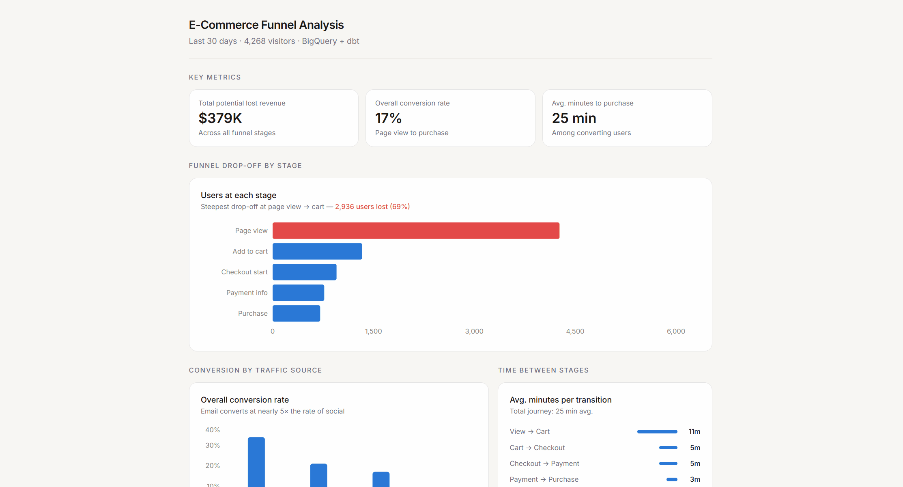

# E-Commerce Funnel Analysis

## Summary
A modular dbt pipeline built on BigQuery that transforms raw e-commerce event data into a 5-stage purchase funnel model, from page view to purchase.

## Business Question
Addresses the problem of potential lost revenue across the purchase funnel. The goal was to identify the stage at which the steepest drop-off occurs, quantify the revenue impact, and determine whether conversion differs by acquisition channel.

## Tech Stack
- BigQuery
- SQL
- dbt
- Figma

## Structure
models/
  staging/        # stg_user_events
  intermediate/   # int_funnel_stages, int_user_journey_times
  marts/          # fct_funnel_summary, fct_funnel_by_source, fct_time_to_conversion

## Key Findings
- The view-to-cart stage shows the steepest drop-off — only 31% of 4,268 visitors added to cart, representing 82% of all potential lost revenue ($312,713 of $379,175 total)
- Email converts best at 34% despite generating only 10% of views; social converts worst at 7% despite generating 29% of views — a 27 percentage point gap
- Users who convert do so within 25 minutes on average; view-to-cart is the longest stage at 11 minutes (44% of the total journey)
- Reallocate acquisition spend from social toward email — email users convert at nearly 5x the rate

## Dashboard

Link: https://www.figma.com/make/jRbsL797V5WL0gSDJl0sOu/Ecommerce-Funnel-Stages?fullscreen=1&t=74gKXGrcjbs1t6RB-1&code-node-id=0-9

## Run
> Note: Requires a BigQuery project with the source event data loaded. 
> The raw table schema is: user_id, event_id, event_type, event_date, 
> product_id, amount, traffic_source.

1. Clone the repo
2. Install dependencies: `pip install dbt-bigquery`
3. Load your event data into BigQuery matching the schema above
4. Configure `~/.dbt/profiles.yml` with your BigQuery credentials
5. Run models: `dbt run`
6. Run tests: `dbt test`
